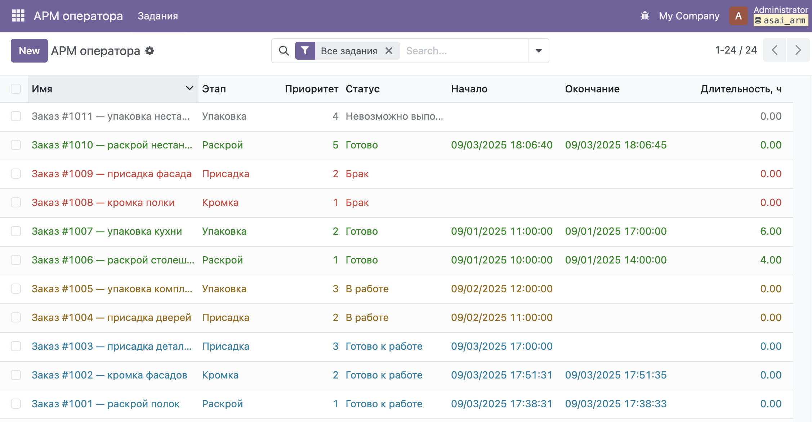
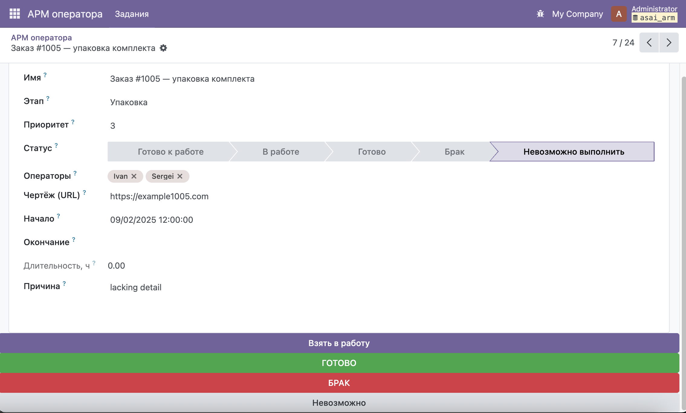

## asai-arm · АСАИ — Тестовое задание — АРМ

## 🚀 Установка и запуск

Клонируйте репозиторий:
```bash
git clone https://github.com/Vereneya-aya/asai-arm.git
```
Перейдите в директорию проекта:
```bash
cd asai_arm
```
Поднимите контейнеры:
```bash
docker compose up -d
```
Проверьте, что сервисы запустились:
```bash
docker compose ps
```
Посмотрите логи Odoo (при необходимости):
```bash
docker compose logs -f odoo
```
Откройте интерфейс Odoo по адресу:
http://localhost:8069

Создайте базу данных и установите модуль asai_arm из списка приложений.
После установки модуль доступен в меню: АРМ оператора → Задания.

Остановить и удалить контейнеры (при необходимости):
```bash
docker compose down
```
⸻
## 📹 Видео-демонстрация
В начале — полный пользовательский сценарий с комментариями; затем — ключевые фрагменты кода (модели, виды).

🔗 Ссылка на видео: .
⸻

## 📝 Что реализовано

Модуль **asai_arm** — автоматизированное рабочее место оператора (АРМ).  
Операторы берут задания в работу, завершают, фиксируют брак/невозможность выполнения с обязательной причиной.

**Основные возможности:**
- 📋 Список заданий с подсветкой строк по статусам.
- 🔄 Переходы между статусами:
  - Готово к работе → В работе → ГОТОВО
  - Любой статус → Брак (с указанием причины)
  - Любой статус → Невозможно выполнить (с указанием причины)
- 🧑‍🤝‍🧑 Привязка задания к одному/нескольким операторам.
- 🕒 Автоматический расчёт длительности (начало/конец).
- 🔍 Фильтры и группировки:
  - Готовы к работе
  - В работе
  - Мои
  - Текущие
  - Все задания
- ✅ Тесты на ключевые сценарии (создание, выполнение, ошибки ввода).

**Уровень сложности:**
- ✅ Easy: список заданий, базовые статусы, кнопки действий.
- ✅ Medium: полноценные переходы, работающие кнопки и тайм-метки, фильтры/группировки, учёт нескольких операторов, тесты.
- ✅ Hard (частично): обязательная причина для «Брак»/«Невозможно выполнить», расширенная подсветка, сохранение истории.

---

## 📂 Структура проекта

- `models/job.py` — модель задания, логика переходов.
- `views/job_views.xml` — списки, формы, действия, поиск, меню.
- `data/demo_jobs.xml` — демонстрационные записи в разных статусах.
- `tests/test_jobs.py` — автотесты критичных сценариев.
- `README.md` — этот документ.
- ⸻

## 🧪 Тесты

Запуск тестов модуля:
```bash
docker compose run --rm odoo odoo -i asai_arm --test-enable --stop-after-init
```
Покрыто: создание задания; переход «В работе»; завершение «ГОТОВО» (проверка времени окончания); запрет «Брак» без причины; «Брак» с причиной; «Невозможно выполнить» с обязательной причиной.


